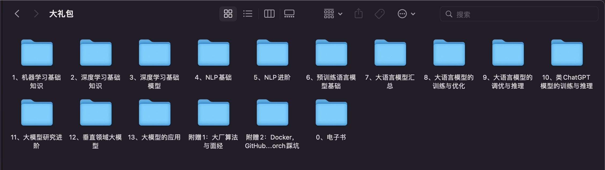
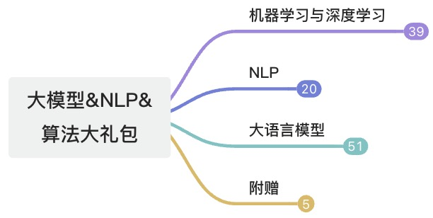
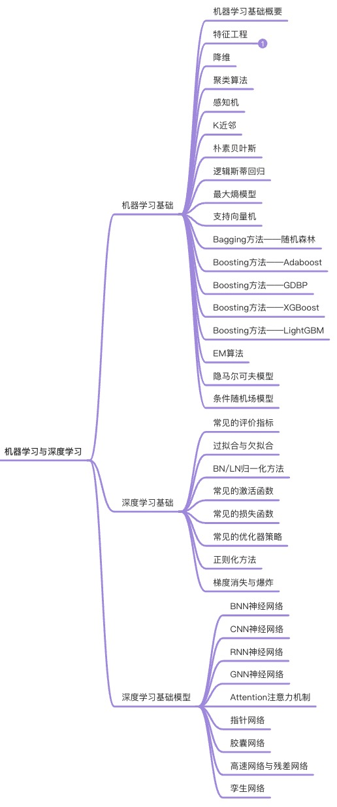
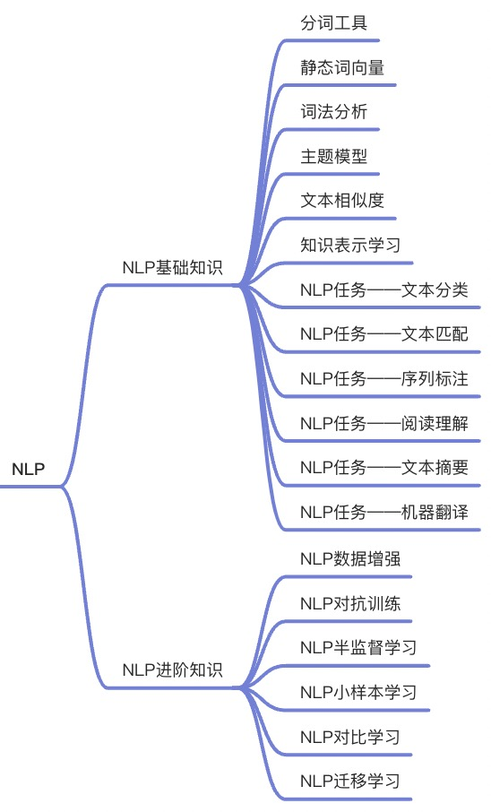
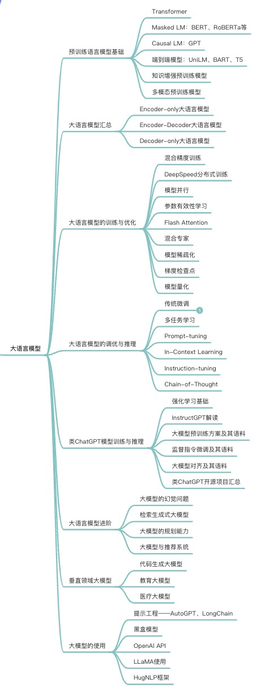
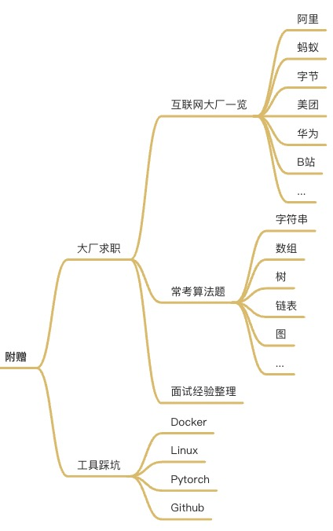
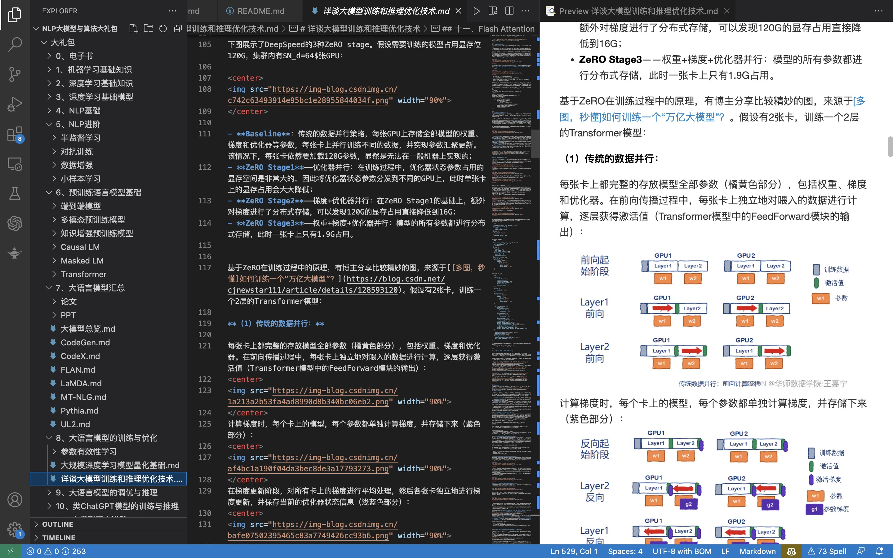
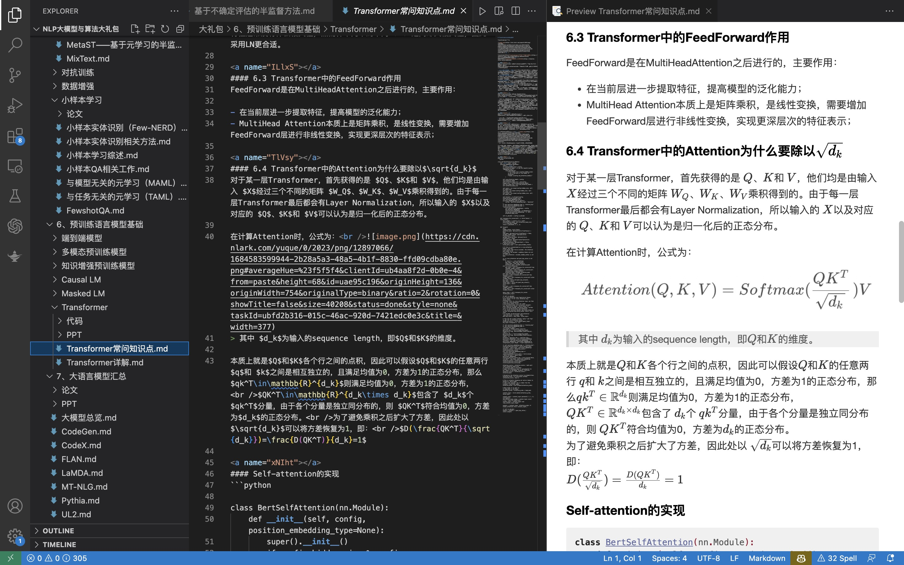

# 大模型 & NLP & 算法 大礼包

目前大模型和ChatGPT的发展迅速，NLP算法的技术更新快速，网上涌现出大量关于大模型、NLP、算法等相关博客、公众号文章以及学术论文。然而，读者能够全面系统的学习这些知识需要花费大量的时间精力去搜索，学习效率低下，不能够适应现在的大模型发展潮流。

因此，**博主根据近几年来积累学习和整理的相关知识，以及最近大模型与ChatGPT相关的技术原理，整理了“大模型&NLP&算法大礼包”**，呈现给各位读者用户，方便全面系统的掌握NLP的基础知识、算法、大模型等内容。

博主整理了共计13个大类知识体系，并汇总了一份完整的电子书，另外附赠大模型/NLP算法工程师求职用的算法题和面经，以及一些工具的使用。

资料目录如下图所示：

知识层级总览图如下所示：

| 总览图 |
| -- |
| 

 |

| 机器学习与深度学习 | NLP | 大规模语言模型 | 附赠 |
| -- | -- | -- | -- |
| 

 | 

 | 

 | 

 |

---

### 作者信息：

作者：王嘉宁

网址：[https://wjn1996.github.io/](https://wjn1996.github.io/)

CSDN：[https://wjn1996.blog.csdn.net/](https://wjn1996.blog.csdn.net/)

知乎：[https://www.zhihu.com/people/wjn1996](https://www.zhihu.com/people/wjn1996)

GitHub：[https://github.com/wjn1996](https://github.com/wjn1996)

### 资料信息
名称：大模型&NLP&算法大礼包

版本：V1.0

资料大纲：详见[资料大纲&试读](./%E8%B5%84%E6%96%99%E5%A4%A7%E7%BA%B2%26%E8%AF%95%E8%AF%BB/)

更新时间：2023年06月26日

价格：【~~原价：¥99.9~~】【特价：**¥59.9**】
**付款成功后，即可获取全部资料**

| 微信 |支付宝 |
|--|--|
| 

 | 

 |

购买须知：
- 请使用微信或支付宝进行购买，购买时一定要添加备注，内容包括：**姓名、邮箱**，方便作者核实。如果备注字数限制邮箱地址填写不下，请加作者微信（微信号：lygwjn）。
- 对于在作者[CSDN的付费专栏“大模型 & NLP & 算法 知识大礼包”](https://wjn1996.blog.csdn.net/article/details/131466477)订阅的用户，无需再次付款，请加微信或发邮件告知作者，并提供CSDN账号和邮箱即可。
- 已经购买的用户，可加入下面的群聊，入群申请请填写姓名和邮箱，入群后更改备注为“姓名+邮箱”，方便作者核实。若群二维码失效，请加作者微信。群内提供与资料相关的QA服务，可及时获得最新版本提醒。

- 在上午9:00至晚上11:00期间，付款成功后，作者会及时通过邮箱发送资料，**如长时间没有发送，可能作者正忙，可邮件或微信催促**；其余时间付款，作者会在上午9点统一发送。**请放心，作者不会漏掉每一个用户**。

价格说明：
- 该资料为作者在硕博期间长达多年知识积累产生的结果，根据其所属价值进行合理地定价；
- 价格解释权归作者所有。
<!-- - 好友粉丝价格说明：资料发布初期，所有用户均享受如您在CSDN、知乎、GitHub上是作者的粉丝，则可以享受**¥59.9**优惠价格。
- 如果您是作者的粉丝，但以原价购买，可凭借个人账号、邮箱和“已关注”的截图联系作者进行差价返现。 -->

服务说明：
- 已购买的用户将代表同意“版权声明”的内容；
- 购买的资料内容围绕机器学习、深度学习、NLP、大模型等内容，包括**文档**、**PPT（作者内部整理的材料）**、**视频（或网上视频链接）**、**论文（部分含有作者的阅读笔记）**和**代码（源码或GitHub链接）**；
- 购买本资料，将额外赠送以下服务：（1）赠送2023年来互联网大厂的常考算法题、面经整理；（2）在[GitHub](https://github.com/wjn1996/LLMs-NLP-Algo/issues)或微信群上提供免费的QA服务；
- 考虑到技术在不断更新，该资料也将持续更新。对于所有已购买本资料的用户，作者会本地记录下购买者的邮箱，待有新版本资料更新完毕时直接通过邮件发送，无需重新购买。
- 服务解释权归作者所有。

---
## News：新粉团购老粉推购活动开启，**最高可享受¥40优惠**

**自该知识资料发布半年以来，受到一定的关注和支持，为了对新老粉丝的回馈，即日起推出“团购”活动，活动内容如下：**
（新粉请看活动A，老粉请看活动B，新粉订阅成功后同样可享受活动B）

**团购活动A**：（限于没有订阅过的新粉）若在订阅时与其他人一起组团订阅，则**每人**可享受**🧧¥20**返现优惠
- 组团方式与步骤：每位团购成员均需要通过付款码付款，并备注昵称邮箱等信息；由至少其中一位成员作为通讯人加作者微信，告知组团成员昵称和邮箱等信息，用于记录团购情况；作者将会通过微信红包形式返还通讯人总优惠金额（团购人数\*20）。
- 退款政策：资料为可复制传播性产品，材料一经发送不可退；
- 活动规则：每人资料都有订阅者专属编号和信息，不可私下里相互传播借阅，不可单人购买后私下售卖或传播；活动A只能参与一次，订阅成功后即成为老粉，因此可参与活动B。

**团购活动B**：（限于已经订阅过的老粉，不论是活动之前还是通过此活动A订阅过的同学均算老粉，作者此处已有记录不可冒名顶替）成功推荐一名新粉前来订阅，**新粉老粉**均可享受**🧧¥20**返现
- 方式与步骤：每位新粉丝需要通过付款码付款，并备注昵称邮箱等信息；由老粉丝联系作者，提供新粉丝的昵称和邮箱等信息；作者会通过微信红包形式返还新老粉总优惠金额。
- 优惠金额说明：推荐一名新粉，新粉老粉均可返现¥20；所有粉丝不论通过何种活动，累积返现最多¥40；
- 退款政策：资料为可复制传播性产品，材料一经发送不可退；
- 活动规则：推荐的新粉丝不可参与团购活动A（新粉要么通过活动A与其他新粉组团，要么通过老粉推荐）；通过老粉推荐成功订阅的新粉，可参与活动B；通过活动A订阅的老粉只能返现¥20，非通过活动A订阅的老粉最多返现¥40；每人资料都有订阅者专属编号和信息，不可私下里相互传播借阅，不可单人购买后私下售卖或传播；

**附赠活动**
新老粉丝**点赞本仓库**并**Follow作者Github**，将点赞和关注记录以及您的github个人链接通过微信发送给作者，额外还能获得¥3红包，每人最多一次。（作者诚信活动，希望粉丝获得红包后不要取关消赞）

¥40返现通关攻略：
- 新粉先通过团购活动A（或老粉通过活动B推荐）订阅，此时可获得¥20返现；订阅成功后，再次推荐1人，获得¥20返现；
- 活动之前订阅的老粉，或未参与活动A直接订阅的老粉，推荐2人，即可返现¥40。

活动说明：所有解释权归作者所有，订阅者不可通过非正规手段做wf行为。

---

### 资料解密
**为了尊重作者的辛苦成果，避免造成损失，请勿随意将该资料整体或部分内容上传至互联网并公开，或通过聊天或群聊等方式分享给他人。十分感谢🙏**

作者为每个购买者会单独设定解密密码。解密密码的生成取决于购买者的邮箱和付款时间戳，密码会存储在资料包里。

该资料购买者只有使用权，不可商用。资料内每个PDF文件都会有作者和购买者的水印以便追踪版权所有者和使用者，因此，请勿将资料和密码分享给他人，或上传至互联网并公开。允许存储在个人网盘，但不允许以链接或密码形式分享。

### 资料阅读
- 推荐使用vscode进行阅读，方便进行索引、编辑等；
- 对于doc、ppt、pdf等文件则使用相应工具打开阅读即可；

绝大多数知识笔记和文档以markdown格式存储，部分文件保存为pdf、ppt等格式。推荐使用VSCode阅读，整个资料的阅读界面如下所示：

### 版权声明

- 本资料约85%部分为博主原创文章、原创笔记等原创性内容，剩余部分包括部分来源于CSDN、知乎等他人文章，以及学术论文、PPT、PDF等资源。所有材料为博主精心整理，购买者请尊重版权，只限个人使用，请勿将材料以任何形式发布或分享给他人；
- 由于部分资料内容为博主从互联网上整理的一些内容，如若该内容涉及到可能侵权的行为，请联系博主进行修改。如果您的文章荣幸被博主收纳到本大礼包中，请联系博主进行，核实成功后将免费赠送，但依然需要遵守第（1）条规范；
- 所有解释权归博主所有。
